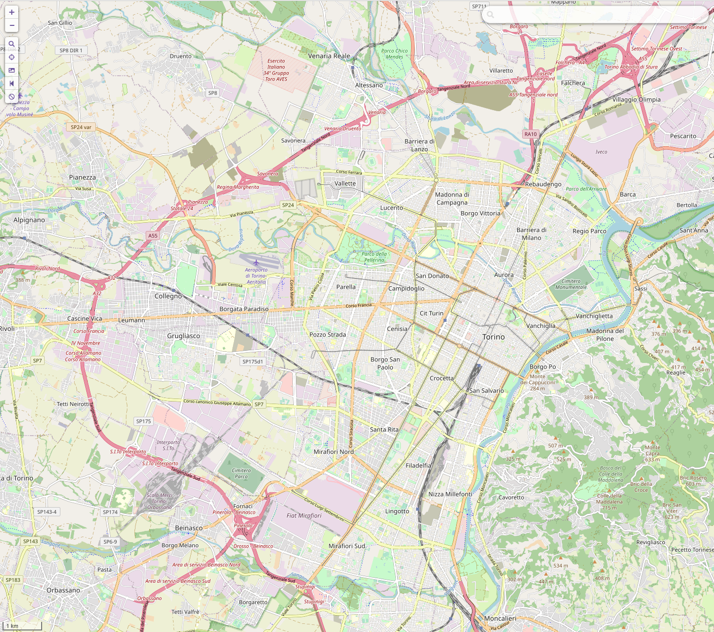
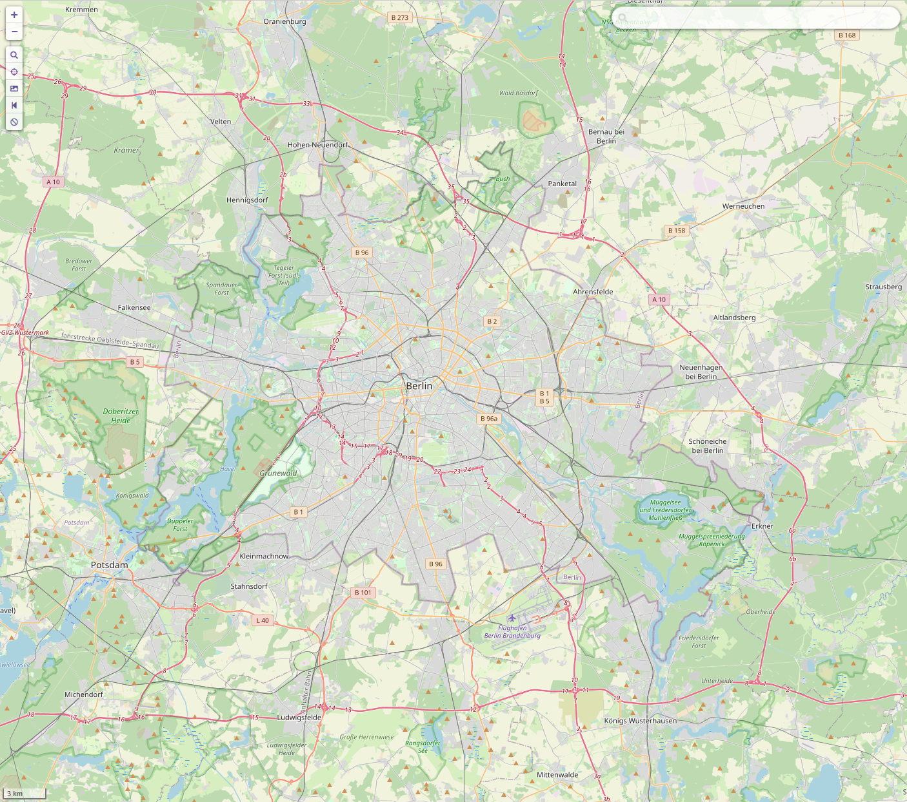

# The Path-Planning Algorithm A*

__*System and Device Programming project Quer 1*__

D'Andrea Giuseppe s303378

De Rosa Mattia s303379

## Problem description

The proposed problem requires to compare the performance of different parallel implementations of the path-planning
algorithm A*.

The main problems of the parallel versions compared to the sequential ones are the exploration of already explored nodes
and the termination condition.

The first problem is solved assigning each node to a different thread using an hash function so that each thread can
keep track of the already explored nodes and avoid unnecessary work.

The second problem has proven to be the main obstacle we found when implementing the parallel versions of A*. In the
sequential version once a path is found we are sure that is the best path we can find given the start and end points. In
the parallel version instead we cannot be sure of the order of exploration of the nodes, so we have to keep
exploring until all the paths remaining are surely worse than the best found. In simple graphs this will allow the
sequential version to explore a minimal part of the graph resulting in better performance than the parallel one.

## Implementation

We chose to develop a sequential version to use for reference and 2 parallel versions. One based on shared memory and
the other one on message passing.

The algorithms are implemented in C++ with additional boost libraries:
- `boost/graph/adjacency_list` - Graph library used to store the graph as an adjacency list.
- `boost/lockfree/queue` - Lock-free queues used to implement message-passing queues

In each version of the algorithm we implemented the openSets with a `std::priority_queue` sorted by the estimated path
length of that node. 

The cost to come to each node and the parent lookup table are stored in dynamically allocated arrays. We also tried to
use `std::unordered_map` to lower memory usage, but the loss of performance was not worth it. 

### Input file

The input file represents a 2D map of nodes, each with a couple of coordinates _(x, y)_ that will be imported as an
undirected weighted graph.

The graph files are provided as text files with a specific format:

```
n_nodes
coordx_1 coordy_1
.
.
.
coordx_n coordy_n
index_node_j index_node_k weight
.
.
.
index_node_w index_node_z weight
```

In the first line there is the number of nodes, after that n lines with the coordinates of each node, and then there is
the list of each edge using the indexes of the nodes in the list and the weight of the edge.

The text file is parsed and a Graph object is created including all the information provided in the input file.

### Heuristic function

We chose the $L_2$ norm distance from vertex __i__ to destination vertex __d__ as the heuristic function. We can compute
it given the coordinates of the nodes with the formula: $$ h(i) = \sqrt{ (d_x - i_x)^2 + (d_y - i_y)^2 } $$
The weight of the edges in the graph is computed with the same function. This heuristic can never overestimate the
cost and follows the triangle inequality, in other words it is _admissible_ and _consistent_, so we can be sure that in
the sequential version, the first path found will be the best one.

### Parallelism

The parallelism is obtained using `std::thread`, the implementation of threads of C++ standard library. Synchronization
is managed with `std::barrier` for both version and `std::mutex` is used to protect shared resources in the shared
version.

In the message passing version message queues are implemented using boost lock-free queues. Each thread explore its own
nodes and add work to the message queues of the other threads. The threads are synchronized every time they have no work
to do to check for the termination condition.

In the shared memory version all the shared resources are protected by locks, and the threads are synchronized when
checking for the termination condition with the same strategy used for message passing.

### Termination condition

The basic termination condition for a parallel implementation of A* could be to stop every thread as soon as every
openSet is empty. Without additional constraints this would lead to the exploration of all the graph. To avoid this, we 
keep track of the best path found so far, and we add a node to the openSet only if its estimated cost is less than the
best path. In this way we can be sure to explore a node only if there is the possibility to find a better path, and this
is acceptable only if the heuristic function never overestimates the goal (_admissible_).

Every time a thread find that its openSet is empty, it hits a barrier, waiting for the other threads. When everyone hit
the barrier, they can check if every other thread has finished its work, in that case we know that the best path has
been found and can be reconstructed.

### Path reconstruction

The path is reconstructed starting from the `cameFrom` array which contains the parent of all the nodes explored,
starting from the destination node we add the parent to the path until we reach the source node.

In the shared version the `cameFrom` array is a global variable and the path can be reconstructed by the main thread
once all the worker threads finished, so we can expect the same performance of the sequential one.

In the message passing version instead the information on the parent of a node is known only by the owner of that node,
and we have to use messages and semaphores to synchronize the threads and reconstruct the path. In this case we can
expect worse performance compared to the other versions caused by the overhead of the messages and the semaphores.

## Results

All the results presented are obtained on a Windows machine with an AMD Ryzen 7 3700X with 8 physical cores and 16
logical threads. The executables are compiled using MSVC 17.0 and cmake 3.23.2 with option `-DCMAKE_BUILD_TYPE=Release`
to optimize the binaries for performance.

### Test graphs

To test the performance of the different algorithms we used 5 different graphs, 2 generated with `graph_generation` with
different sizes and K neighbors and 3 generated starting from real cities using OpenStreetMap API. The edges in the
graph represents real roads in the cities, and to each type of road has been assigned a different weight to make a more
realistic simulation. 

- `k-neargraph_1000_20000_30.txt`: 20000 nodes on a 1000x1000 grid. Each node is connected to its 30 nearest neighbors.
- `k-neargraph_1500_50000_59.txt`: 50000 nodes on a 1500x1500 grid. Each node is connected to its 59 nearest neighbors.
- `turin.txt`: 95228 nodes
- `berlin.txt`: 364873 nodes
- `newyork.txt`: 3946582 nodes. Includes New York and part of Philadelphia

|  |  |  |
| :--: | :--: | :--: |
| Turin area | Berlin area | New York area |


### Path reconstruction

To test path reconstruction time we averaged the time of 750 runs of each algorithm with 150 different source and
destination points for each graph.

|                      | k-near 20000  | k-near 50000  | Turin         | Berlin        | New York      |
|----------------------|---------------|---------------|---------------|---------------|---------------|
| A* Sequential        | 2.390e-06 s   | 3.493e-06 s   | 1.4338e-05 s  | 6.9426e-05 s  | 0.000403660 s |
| HDA* Shared          | 3.957e-06 s   | 5.057e-06 s   | 1.3706e-05 s  | 6.7179e-05 s  | 0.000399261 s |
| HDA* Message Passing | 0.000476632 s | 0.001019622 s | 0.001674454 s | 0.008170810 s | 0.044614082 s |

As we expected the time needed for the sequential and the shared version are the same, the message passing instead is
slower in all cases due to the overhead of the synchronization of the different threads.

### Results by type of graph

### Results by processor count

### Results by path length

### Results by total node visited


