<div style="text-align: justify">


# The Path-Planning Algorithm A*

__*System and Device Programming - Project Quer 1*__

D'Andrea Giuseppe s303378

De Rosa Mattia s303379

## Problem description

The proposed problem requires to compare the performance of different parallel implementations of the path-planning
algorithm A*.

The main problems of the parallel versions compared to the sequential ones are the division of work between the
different threads and the termination condition.

The first problem is solved by assigning each node to a different thread using an hash function so that each thread can
keep track of the already explored nodes and avoid repeating work.

The second problem has proven to be the main obstacle we found when implementing the parallel versions of A*.
The first path found by the sequential version is always the best path from the start to the end position, so we can
terminate the algorithm immediately. This is not true for the parallel version since we can't be sure of the order of
exploration of the nodes, so we have to keep exploring until all the remaining (partial) paths are worse than the
current best. Because of the need to explore more paths than needed we expect parallel algorithms to achieve better
performance on more complex graphs.

## Implementation

We developed a sequential version to use for reference and two parallel versions: the first based on shared memory and the
second on message passing.

The algorithms are implemented in C++ with additional boost libraries:

- `boost/graph/adjacency_list` - Graph library used to store the graph as an adjacency list.
- `boost/lockfree/queue` - Lock-free queues used to implement message-passing queues

In each version of the algorithm we implemented the openSets with a `std::priority_queue` sorted by the estimated path
length of that node.

We initially used the standard library implementation of hash maps (`std::unordered_maps`) for the  "cost to come" and
parent lookup tables, but we noticed they caused performance and synchronization issues, so we opted to use dynamically
allocated array to solve them. We think the higher memory usage of this solution was worth it for the performance
improvements.

### Input file

The input file represents a 2D map of nodes, each defined as a couple of coordinates _(x, y)_ that will be imported as
an undirected weighted graph.

The graph files are provided as text files with a specific format:

```
n_nodes
coordx_1 coordy_1
.
.
.
coordx_n coordy_n
index_node_i index_node_j weight
.
.
.
index_node_w index_node_z weight
```

The first line represents the number of nodes, followed by n lines containing the coordinates of each node, finally a
list of edges using the indexes of the nodes in the list and the weight of the edge.

The text file is parsed and a Graph object is created including all the information provided in the input file.

### Heuristic function

We chose the $L_2$ norm distance from vertex __i__ to destination vertex __d__ as the heuristic function. We can compute
it given the coordinates of the nodes with the formula: $$ h(i) = \sqrt{ (d_x - i_x)^2 + (d_y - i_y)^2 } $$
The weight of the edges in the graph is computed with the same function. This heuristic can never overestimate the
cost and follows the triangle inequality, in other words it is _admissible_ and _consistent_, so we can be sure that in
the sequential version, the first path found will be the best one and each node will be explored at most once.

### Parallelism

The parallelism is obtained using `std::thread`, the C++ standard library implementation of threads. Thread
synchronization is managed with multiple primitives:

- `std::barrier` is used in both versions to check for the termination condition
- `std::mutex` is used to protect resources in the shared memory version
- `std::counting_semaphore` is used for path reconstruction in the message passing version

In the message passing version, message queues are implemented using boost lock-free queues. Each thread explores its
own nodes and adds work to the message queues of the other threads. The threads are synchronized every time they have no
work to do to check for the termination condition.

In the shared memory version all the shared resources are protected by locks, and the threads are synchronized when
checking for the termination condition with the same strategy used for message passing.

### Termination condition

A basic solution for the parallel A* termination condition is to stop every thread as soon as every openSet is empty.
Without additional constraints this would lead to the full exploration of the graph.

To avoid this, we keep track of the best path found so far, and we add a node to the openSet only if its estimated
cost (cost to come + heuristic) is less than the total cost of the best path. In this way we can be sure to explore a
node only if there is the possibility to find a better path, and this is acceptable only if the heuristic function never
overestimates the goal (_admissible_).

Every time a thread empties it's openSet, it stops on a barrier, waiting for the other threads to complete their work
too. After every thread hits the barrier, we check if every openSet is still empty and in that case we terminate and can
start the path reconstruction phase.

### Path reconstruction

The path is reconstructed using the `cameFrom` array which contains the parent of all the nodes explored. Starting from
the destination node we add the parent to the path until we reach the source node.

In the shared version the `cameFrom` array is a global variable and the path can be reconstructed by the main thread
once all the worker threads terminate, so we can expect similar performance to the sequential version.

In the message passing version the information on the parent of a node is known only by the owner of that node, so we
have to use messages and semaphores to synchronize the threads and reconstruct the path. In this case we can expect
worse performance compared to the other versions caused by the overhead of the messages and the semaphores.

<p style="page-break-after: always;">&nbsp;</p>

## Results

All the results presented are obtained on a Windows machine with an AMD Ryzen 7 3700X with 8 physical cores and 16
logical threads. The executables are compiled using MSVC 17.0 and cmake 3.23.2 with option `-DCMAKE_BUILD_TYPE=Release`
to optimize the binaries for performance.

### Test graphs

To test the performance of the different algorithms we used 5 different graphs, 2 generated with `graph_generation` with
different sizes and k-neighbors and 3 generated starting from real cities using OpenStreetMap API. The edges in the
graph represents real roads in the cities, and to each type of road has been assigned a different weight to make a more
realistic simulation.

- `k-neargraph_1000_20000_30.txt`: 20,000 nodes on a 1,000x1,000 grid. Each node is connected to its 30 nearest neighbors.
- `k-neargraph_1500_50000_59.txt`: 50,000 nodes on a 1,500x1,500 grid. Each node is connected to its 59 nearest neighbors.
- `turin.txt`: 95,228 nodes
- `berlin.txt`: 364,873 nodes
- `newyork.txt`: 3,946,582 nodes. Includes New York and part of Philadelphia

| 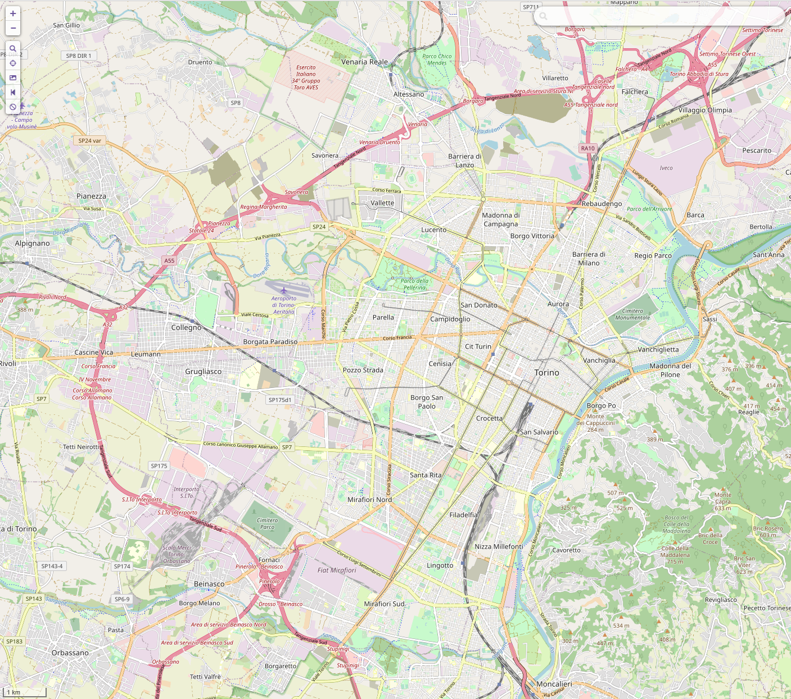 | 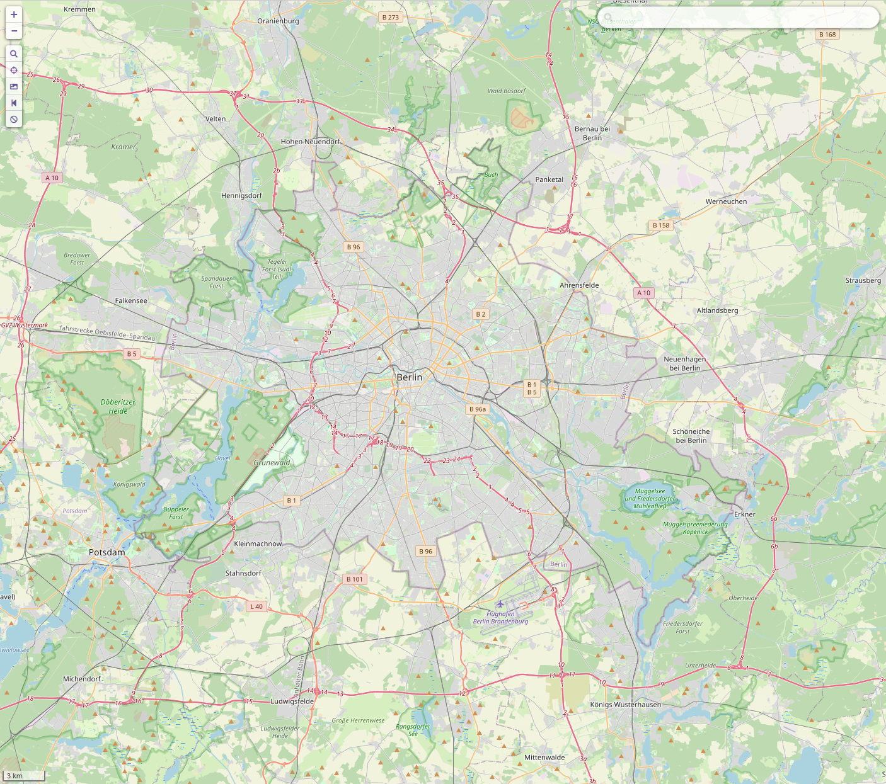 | 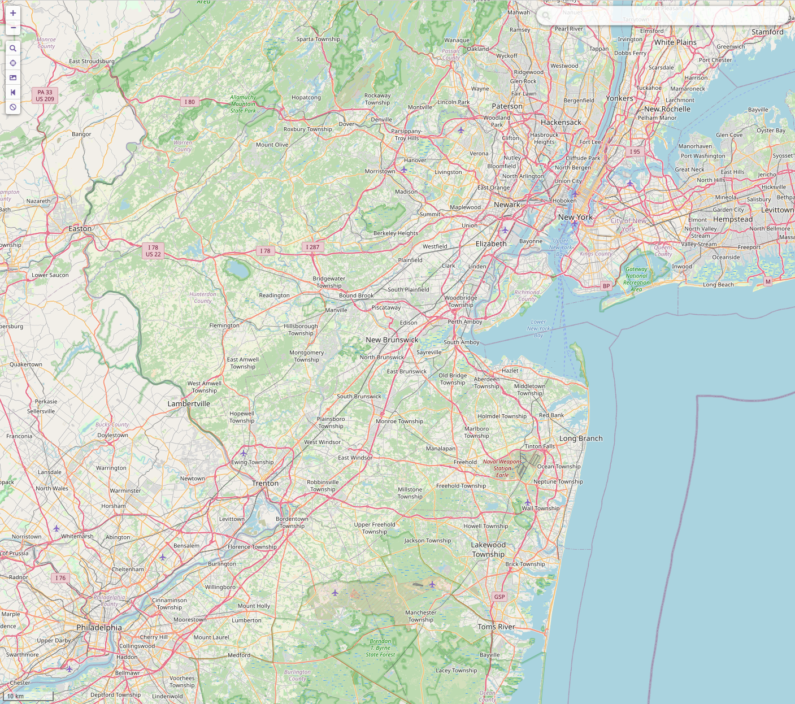 |
| :--: | :--: | :--: |
| Turin area | Berlin area | New York area |

### Path reconstruction

To test path reconstruction time we averaged the time of 750 runs of each algorithm with 150 different source and
destination points for each graph. Parallel versions executed with 16 threads.

| Path reconstruction time (s) | k-near 20000  | k-near 50000  | Turin         | Berlin        | New York      |
|------------------------------|---------------|---------------|---------------|---------------|---------------|
| A* Sequential                | 2.390e-06 s   | 3.493e-06 s   | 1.4338e-05 s  | 6.9426e-05 s  | 0.000403660 s |
| HDA* Shared                  | 3.957e-06 s   | 5.057e-06 s   | 1.3706e-05 s  | 6.7179e-05 s  | 0.000399261 s |
| HDA* Message Passing         | 0.000476632 s | 0.001019622 s | 0.001674454 s | 0.008170810 s | 0.044614082 s |

As we expected the time needed for the sequential and the shared version are the same, the message passing instead is
slower in all cases due to the overhead of the synchronization of the different threads.

<p style="page-break-after: always;">&nbsp;</p>

### Results by type of graph

The two type of graphs considered brought very different results because of how they were created.

When creating a k-neighbors graph we used a relatively high value for k to ensure the graph is well connected,
for example for the version with 50K nodes we chose k=59 and the graph generated contains more than 1.5M edges.

Graph representing cities instead contains a similar number of edges and nodes. For example New York has
almost 4M nodes and about 4M edges.

Another difference between these two types of graphs is how the edge weight is calculated: in a k-neighbors graph
the weight is equal to the euclidean distance of the nodes (the same as the heuristic function), while for the
city map graphs there is an additional multiplier based on the type of road (larger roads have lower weight over
the same distance).

This was done to force the A* algorithms to explore multiple paths, instead of just choosing the most straightforward
one.

For these reasons we can expect the sequential version to explore a minimal number of nodes thanks to the better
termination condition and to outperform the parallel versions in the k-neighbors graphs.

|                   |     Nodes |     Edges | Edges/Nodes |
|-------------------|----------:|----------:|------------:|
| k-neighbors 20000 |    20,000 |    78,400 |        3.92 |
| k-neighbors 50000 |    50,000 | 1,570,551 |       31.40 |
| Turin             |    95,228 |   105,173 |        1.10 |
| Berlin            |   371,857 |   394,062 |        1.06 |
| New York          | 3,946,582 | 4,189,184 |        1.06 |


Average nodes explored on 750 test runs with 150 different source and destination node. Parallel versions executed with
16 threads.

| Nodes explored    |        A* |   HDA* SM |   HDA* MP |
|-------------------|----------:|----------:|----------:|
| k-neighbors 20000 |       263 |    11,357 |    14,499 |
| k-neighbors 50000 |       409 |    18,621 |    23,976 |
| Turin             |    34,105 |    67,363 |    59,701 |
| Berlin            |   137,729 |   250,513 |   203,157 |
| New York          | 1,028,596 | 3,748,860 | 1,512,746 |

As we can see from the table above, the ratio between the explored nodes in parallel A* and sequential A* is much bigger
for the k-neighbors graphs. Because of this the parallel algorithm has to perform much more work in simpler graphs, so 
we have a speedup lower than 1.

<p style="page-break-after: always;">&nbsp;</p>

The tables below show the average execution times and speedup relative to the sequential algorithm.

| Execution Time (s) | A*       | HDA* SM  | HDA* MP  |
|--------------------|----------|----------|----------|
| k-neighbors 20000  | 0.000750 | 0.015804 | 0.023570 |
| k-neighbors 50000  | 0.002233 | 0.046271 | 0.081431 |
| Turin              | 0.023139 | 0.016814 | 0.012732 |
| Berlin             | 0.115325 | 0.057164 | 0.042795 |
| New York           | 1.306676 | 0.821321 | 0.324319 |

| Speedup           | A*  | HDA* SM | HDA* MP |
|-------------------|-----|---------|---------|
| k-neighbors 20000 | 1x  | 0.047x  | 0.031x  |
| k-neighbors 50000 | 1x  | 0.048x  | 0.027x  |
| Turin             | 1x  | 1.376x  | 1.817x  |
| Berlin            | 1x  | 2.017x  | 2.695x  |
| New York          | 1x  | 1.591x  | 4.029x  |

### Speedup by thread count

| 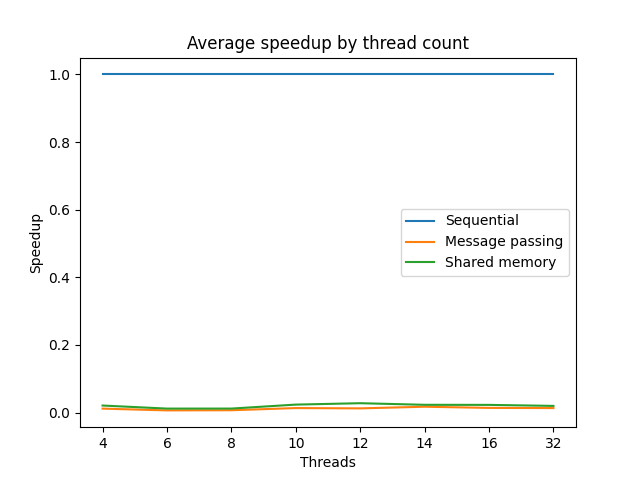 | 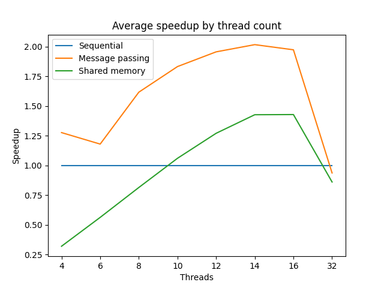 |
| :--: | :--: |
| k-neighbors 50K | Turin area |

| 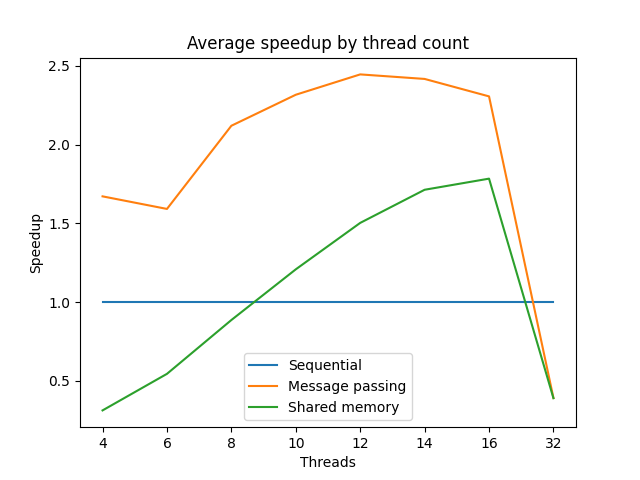 | 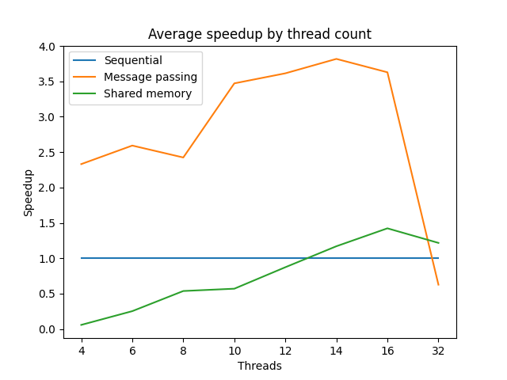 |
| :--: | :--: |
| Berlin area | New York area |

As we can see from the figures above the speedup increases alongside the thread count until we reach the number of
logical threads on the CPU, where we can see a steep decrease in performance due to the overhead of context switching.

We can also notice from the graphs how the shared memory implementation isn't faster than the sequential until we reach
an appropriate number of threads for the size of graph. For example, in Turin 10 threads are enough to outperform the
sequential, while for New York at least 14 threads are needed.

### Speedup by path length

As we stated before we expect a lower speedup on smaller or more linear graphs, we can prove this by plotting the
average execution time against the path length for the various graphs.

| 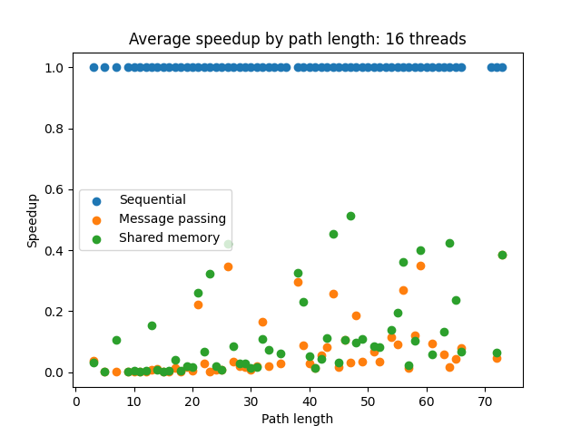 | 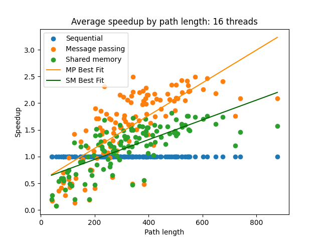 |
| :--: | :--: |
| k-neighbors 50K | Turin area |

| 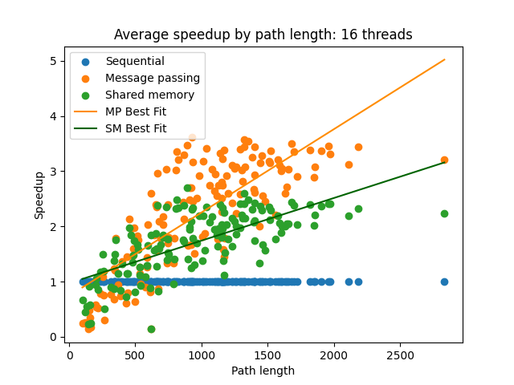 | 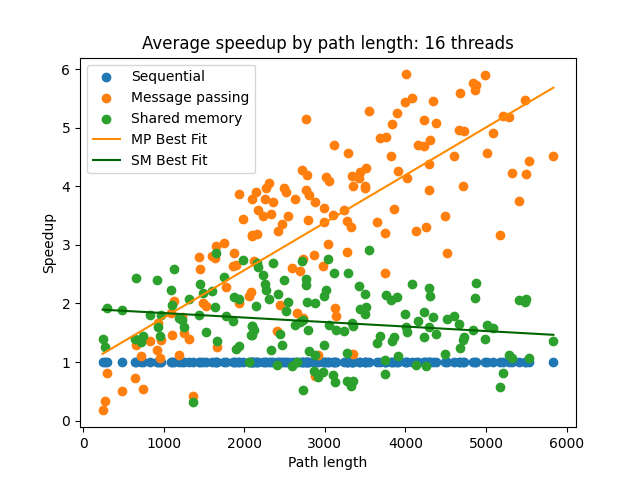 |
| :--: | :--: |
| Berlin area | New York area |

From the result above we can see that the speedup is higher on more complex graphs for the parallel algorithms.
This is true except for the SM version on the New York map (the most complex one we tested) where the cause is likely
the contention of the shared resources and the overhead of mutexes.
This can be probably mitigated by increasing the number of threads.

<p style="page-break-after: always;">&nbsp;</p>

## Conclusions

In summary, message passing outperforms the shared version in most cases but to observe an improvement over the
sequential we need a complex enough graph. K-neighbors graphs without obstacles are too simple to gain an advantage from
the parallelism, while the sequential with a good heuristic will always find a relatively straight path exploring only a
minimal part of the graph.

The performance of the shared memory algorithm are drastically affected by the size of the graph and the amount of
work to do, so a higher thread count is needed for graphs of increasing size to better distribute the work and avoid
contention.

This project could be extended by implementing different termination conditions, for example using a sum flag, which
could be implemented with a condition variable, to determine if the thread has finished working. This solution might
improve the performance over the barrier method since a thread could resume as soon as it receives more work, instead of
having to wait until all threads reach the barrier.

Another study subject could be determining better weightings for the different road types, to see how performance
changes between the various algorithms.


</div>
